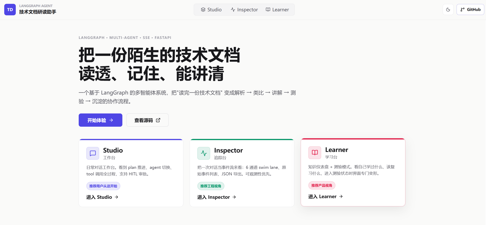

# Tech Doc Reader Agent

[](https://github.com/pipehui/tech-doc-reader-agent/actions/workflows/ci.yml)

一个面向技术文档研读场景的 LangGraph 多智能体系统。它把“理解一个陌生技术概念”拆成解析、关联、讲解、测验和沉淀，并通过 Studio / Inspector / Learner 三个视角展示同一条会话状态。

项目最初参考了 LangGraph 多助手教程中的对话状态管理思路；当前的 `PlanWorkflow`、Adaptive 路由、Hybrid RAG、HITL 审批、SSE Inspector、长期学习状态和 eval 基线为本项目围绕技术学习场景的自主扩展。



## What It Shows

- `primary` 按任务复杂度选择 direct response、single-agent 或 `parser -> relation -> explanation` 链式研读。
- FastAPI 通过 async SSE 输出 token、tool、plan、agent transition、interrupt 等事件，前端实时渲染。
- Redis checkpointer 支持会话恢复；敏感工具在写入前触发 HITL 审批。
- 本地文档库使用 BM25 + Vector + RRF 的 Hybrid RAG，并提供检索 eval。
- 学习记录、学习轨迹 memory、长期用户画像分层存储，后续回答可读取用户上下文。
- `trace_id` 贯穿 SSE、结构化日志和 Langfuse callback，便于定位多 agent 链路问题。
- CI 覆盖 lint、基础类型检查、pytest 和前端构建。

## Results

当前 full agent eval（2026-04-30，25 cases，覆盖 direct、学习状态读取、examination、multi-agent 标准链路和 boundary/refusal）：

| Cases | Done | Error | Plan Match | Keyword | Behavior | E2E p50 | E2E p95 | Tool Results Avg | Structured Results Avg | Interrupts |
|---:|---:|---:|---:|---:|---:|---:|---:|---:|---:|---:|
| 25 | 25 | 0 | 0.96 | 0.98 | 0.99 | 14.69s | 226.41s | 3.00 | 1.60 | 6 |

当前 full retrieval eval（2026-04-29，60 cases，Top K=5）：

| Mode | Recall@5 | Hit@1 | MRR | Keyword Coverage | E2E p50 | E2E p95 |
|---|---:|---:|---:|---:|---:|---:|
| BM25-only | 0.85 | 0.37 | 0.56 | 0.97 | 0.020s | 0.021s |
| Vector-only | 0.88 | 0.52 | 0.65 | 0.97 | 0.927s | 1.609s |
| Hybrid | 0.93 | 0.53 | 0.70 | 0.98 | 1.209s | 2.148s |

当前 async SSE concurrency smoke（2026-04-30，11 enabled cases，10 并发，自动拒绝 HITL 写入审批）：

| Concurrency | Valid | Error Rate | Final Interrupted | Auto-Rejected Interrupts | TTFT p50 | TTFT p95 | E2E p50 | E2E p95 | Tool Events Avg |
|---:|---:|---:|---:|---:|---:|---:|---:|---:|---:|
| 10 | 11/11 | 0.0% | 0.0% | 2 | 0.70s | 4.59s | 22.76s | 225.57s | 3.18 |

更多评测命令、指标解释和边界 case 判定方式见 [docs/evaluation.md](docs/evaluation.md)。

## Architecture


核心运行路径：

1. `Client + FastAPI` 通过 `/chat` 建立 SSE 事件流。
2. `primary assistant` 识别用户目标，直接回答或生成 `PlanWorkflow`。
3. 多 agent 链路通常按 `parser -> relation -> explanation` 推进，必要时进入 `examination` 或 `summary`。
4. 工具层连接共享文档库、Hybrid retriever、Web search、Learning store、Memory store 和 User profile。
5. Redis checkpointer 保存 LangGraph thread，`user_id + namespace + session_id` 定位会话。

详细设计见 [docs/architecture.md](docs/architecture.md)。

## Quickstart

复制环境变量模板：

```bash
cp .env.example .env
```

启动 Redis 和后端：

```bash
docker compose up -d redis
PYTHONPATH=. uvicorn tech_doc_agent.app.api.server:app --reload
```

启动前端开发服务：

```bash
cd frontend
npm install
npm run dev
```

访问：

```text
http://127.0.0.1:5173
```

更多本地开发、Docker、数据目录和知识库初始化说明见 [docs/development.md](docs/development.md)。

## Documentation

| Document | Content |
|---|---|
| [docs/architecture.md](docs/architecture.md) | 多 agent 编排、状态流转、工具层和数据层设计 |
| [docs/evaluation.md](docs/evaluation.md) | Agent eval、retrieval eval、concurrency benchmark 和指标解释 |
| [docs/learning-state.md](docs/learning-state.md) | 学习记录、学习轨迹 memory、长期用户画像的边界和写入策略 |
| [docs/observability.md](docs/observability.md) | `trace_id`、结构化日志、SSE 事件和 Langfuse tracing |
| [docs/api.md](docs/api.md) | REST / SSE API 参考 |
| [docs/development.md](docs/development.md) | 本地启动、Docker、质量检查、项目结构和运行时数据 |

## Tech Stack

- Backend: FastAPI, LangGraph, LangChain, Redis checkpointer
- Retrieval: FAISS, BM25, Vector search, RRF, metadata filter
- Observability: structured logs, SSE event stream, Langfuse callback
- Frontend: React, Vite, TypeScript
- Quality: pytest, ruff, mypy, online eval, retrieval eval, concurrency benchmark
