# Architecture

Tech Doc Reader Agent 是一个围绕“技术概念学习”设计的多智能体系统。它不把所有任务都交给一个聊天模型，而是先判断任务复杂度，再选择直接回答、单 agent 或多 agent 链路。

## Request Path

1. 前端通过 `POST /chat` 发起请求，FastAPI 返回 SSE 事件流。
2. `ChatRuntime` 构建 LangGraph config，注入 `thread_id`、`trace_id`、`user_id` 和 `namespace`。
3. `fetch_user_info` 读取长期用户画像和相关学习轨迹 memory。
4. `primary assistant` 选择 direct response、工具调用或 `PlanWorkflow`。
5. LangGraph 根据计划进入 `parser`、`relation`、`explanation`、`examination` 或 `summary`。
6. 敏感工具节点使用 `interrupt_before` 暂停，等待 `/chat/approve` 继续。

## Agents

| Agent | Responsibility |
|---|---|
| `primary` | 理解用户目标，决定 direct / single-agent / multi-agent 路径 |
| `parser` | 读取文档、本地知识库或 Web search，提取结构化信息 |
| `relation` | 检索相关知识、类比和边界，辅助解释 |
| `explanation` | 面向用户生成最终概念解释 |
| `examination` | 出题、评估掌握情况，并可更新学习记录 |
| `summary` | 总结本轮学习过程，沉淀学习记录和学习轨迹 memory |

## Scoped Context

系统保留完整 `messages` 作为 LangGraph checkpoint 和审计链路，但不会把完整消息历史直接暴露给所有子 Agent。

可见性边界：

- `primary` 和 `summary` 可以读取完整链路。`primary` 需要做路由和异常接管，`summary` 需要总结用户完整学习轨迹。
- `parser`、`relation`、`explanation`、`examination` 只接收受控 task view：当前用户 query、`learning_target`、handoff 参数、结构化 state，以及本 Agent 自己的工具结果。
- `parser_result` 和 `relation_result` 会以结构化 state 传递给下游，而不是让下游重新读取上游原始聊天消息。

这个设计解决两类问题：

- 避免 `primary` 的搜索结果、临时判断或工具失败消息污染 `parser` 的本地文档优先策略。
- 避免子 Agent 依赖不属于自己职责范围的完整历史，从而更容易保持角色边界。

`examination` 有一个额外状态字段 `examination_context`，用于保存上一轮题目、作答要求和评分标准。用户下一轮提交答案时，路由会直接回到 `examination`，并把 `previous_examination_context` 放入受控 task view；如果用户明确提出总结、解释、文档写入等新任务，则跳出出题模式回到正常路由。

敏感工具审批被拒绝时，运行时会把拒绝理由作为对应工具节点的结果写回 checkpoint，并从原中断节点继续执行，而不是把拒绝反馈当成一条全新的用户消息交给 `primary`。这样 `parser` 的 `save_docs` 被拒绝后会回到 `parser` 自己处理反馈，`examination` 或 `summary` 的写入拒绝也能回到原 Agent 的语境中收束。

## Input Guardrails

`/chat` 和 `/chat/approve` 在进入 LangGraph 前会先运行输入侧 prompt-injection 检测。

- `high` risk：直接返回 `400`，不会进入 graph，也不会触发工具调用。
- `medium` risk：复用 HITL 审批通道返回 `interrupt_required`，审批通过后才把原始用户消息送入 graph，拒绝则停止执行。
- `low` risk：仅记录，正常通过。
- 日志只记录 risk level、finding 名称、输入长度和 trace/session metadata，不写入原始输入文本。

当前 high-risk 规则覆盖系统提示词/开发者消息泄露、jailbreak/DAN、密钥/token 泄露等输入。审批反馈同样会经过 guardrails，因为拒绝理由可能会作为 ToolMessage 写回图状态。

## Routing

`primary` 使用三档策略：

- direct response：打招呼、能力介绍、简单学习状态查询、明确但简单的记录管理请求。
- single-agent：只需要一个专职 agent，例如单独出题或总结。
- multi-agent：学习新概念或机制时，通常使用 `parser -> relation -> explanation`。

复杂任务会生成 `PlanWorkflow`，其中包含：

- `steps`
- `goal`
- `learning_target`

`learning_target` 会被用于学习记录、检索上下文和后续 eval。

## State And Data

LangGraph state 保存：

- `messages`
- `user_id`
- `namespace`
- `user_info`
- `dialog_state`
- `learning_target`
- `workflow_plan`
- `plan_index`
- `parser_result`
- `relation_result`
- `examination_context`

运行时数据层：

- FAISS document store：共享技术知识库
- Hybrid retriever：BM25 + Vector + RRF
- Learning store：轻量学习记录
- Memory store：长期学习轨迹片段
- User profile：长期用户画像
- Web search backend：Tavily + DuckDuckGo fallback
- Redis checkpointer：会话恢复

## Frontend Views

- Studio：日常对话、计划推进、agent 切换、tool 调用和 HITL 审批。
- Inspector：SSE 事件流、swim lane、trace JSON 和调试视图。
- Learner：学习记录、复习队列和测验入口。
