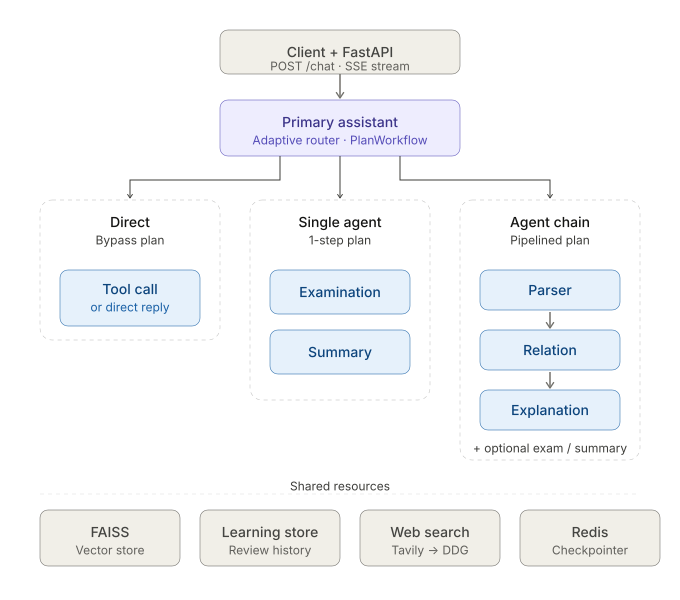

# Architecture

Tech Doc Reader Agent 是一个围绕“技术概念学习”设计的多智能体系统。它不把所有任务都交给一个聊天模型，而是先判断任务复杂度，再选择直接回答、单 agent 或多 agent 链路。

## Request Path

1. 前端通过 `POST /chat` 发起请求，FastAPI 返回 SSE 事件流。
2. `ChatRuntime` 构建 LangGraph config，注入 `thread_id`、`trace_id`、`user_id` 和 `namespace`。
3. `fetch_user_info` 读取长期用户画像和相关学习轨迹 memory。
4. `primary assistant` 选择 direct response、工具调用或 `PlanWorkflow`。
5. LangGraph 根据计划进入 `parser`、`relation`、`explanation`、`examination` 或 `summary`。
6. 敏感工具节点使用 `interrupt_before` 暂停，等待 `/chat/approve` 继续。

## Agents

| Agent | Responsibility |
|---|---|
| `primary` | 理解用户目标，决定 direct / single-agent / multi-agent 路径 |
| `parser` | 读取文档、本地知识库或 Web search，提取结构化信息 |
| `relation` | 检索相关知识、类比和边界，辅助解释 |
| `explanation` | 面向用户生成最终概念解释 |
| `examination` | 出题、评估掌握情况，并可更新学习记录 |
| `summary` | 总结本轮学习过程，沉淀学习记录和学习轨迹 memory |

## Scoped Context

系统保留完整 `messages` 作为 LangGraph checkpoint 和审计链路，但不会把完整消息历史直接暴露给所有子 Agent。

可见性边界：

- `primary` 和 `summary` 可以读取完整链路。`primary` 需要做路由和异常接管，`summary` 需要总结用户完整学习轨迹。
- `parser`、`relation`、`explanation`、`examination` 只接收受控 task view：当前用户 query、`learning_target`、handoff 参数、结构化 state，以及本 Agent 自己的工具结果。
- `parser_result` 和 `relation_result` 会以结构化 state 传递给下游，而不是让下游重新读取上游原始聊天消息。

这个设计解决两类问题：

- 避免 `primary` 的搜索结果、临时判断或工具失败消息污染 `parser` 的本地文档优先策略。
- 避免子 Agent 依赖不属于自己职责范围的完整历史，从而更容易保持角色边界。

`examination` 有一个额外状态字段 `examination_context`，用于保存上一轮题目、作答要求和评分标准。用户下一轮提交答案时，路由会直接回到 `examination`，并把 `previous_examination_context` 放入受控 task view；如果用户明确提出总结、解释、文档写入等新任务，则跳出出题模式回到正常路由。

敏感工具审批被拒绝时，运行时会把拒绝理由作为对应工具节点的结果写回 checkpoint，并从原中断节点继续执行，而不是把拒绝反馈当成一条全新的用户消息交给 `primary`。这样 `parser` 的 `save_docs` 被拒绝后会回到 `parser` 自己处理反馈，`examination` 或 `summary` 的写入拒绝也能回到原 Agent 的语境中收束。

## Input Guardrails

`/chat` 和 `/chat/approve` 在进入 LangGraph 前会先运行输入侧 prompt-injection 检测。

- `high` risk：直接返回 `400`，不会进入 graph，也不会触发工具调用。
- `medium` risk：复用 HITL 审批通道返回 `interrupt_required`，审批通过后才把原始用户消息送入 graph，拒绝则停止执行。
- `low` risk：仅记录，正常通过。
- 日志只记录 risk level、finding 名称、输入长度和 trace/session metadata，不写入原始输入文本。

当前 high-risk 规则覆盖系统提示词/开发者消息泄露、jailbreak/DAN、密钥/token 泄露等输入。审批反馈同样会经过 guardrails，因为拒绝理由可能会作为 ToolMessage 写回图状态。

## Routing

`primary` 使用三档策略：

- direct response：打招呼、能力介绍、简单学习状态查询、明确但简单的记录管理请求。
- single-agent：只需要一个专职 agent，例如单独出题或总结。
- multi-agent：学习新概念或机制时，通常使用 `parser -> relation -> explanation`。

复杂任务会生成 `PlanWorkflow`，其中包含：

- `steps`
- `goal`
- `learning_target`

`learning_target` 会被用于学习记录、检索上下文和后续 eval。

## State And Data

LangGraph state 保存：

- `messages`
- `user_id`
- `namespace`
- `user_info`
- `dialog_state`
- `learning_target`
- `workflow_plan`
- `plan_index`
- `parser_result`
- `relation_result`
- `examination_context`

运行时数据层：

- FAISS document store：共享技术知识库
- Hybrid retriever：BM25 + Vector + RRF
- Learning store：轻量学习记录
- Memory store：长期学习轨迹片段
- User profile：长期用户画像
- Web search backend：Tavily + DuckDuckGo fallback
- Redis checkpointer：会话恢复

各存储的保留、generation、备份恢复与删除前置条件见 [data-lifecycle.md](data-lifecycle.md)。当前除 approval TTL 和
replace-in-place 状态外，不启用自动数据 pruning。

## Dependency Direction Gates

后端依赖边界由 `tests/architecture/import_graph.py` 静态构建真实 Python import graph，再由 `tests/test_architecture_dependencies.py` 声明 contract。分析器递归扫描所有子包，解析 absolute/relative import 和 `from package import module`，不会 import 或执行应用模块。

| Source | 禁止反向依赖 | 当前允许方向 |
|---|---|---|
| `core` | 其他全部 app layer | `core` 内部与第三方基础库 |
| `application` | agents、API、graph、runtime、services、tools、infrastructure、组装入口 | `core` |
| `runtime` | agents、API、graph、services、tools、infrastructure、组装入口 | `application`、`core` |
| `graph` | agents、API、runtime、services、tools、infrastructure、组装入口 | `graph`、`core` |
| `infrastructure` | agents、API、graph、runtime、services、tools、组装入口 | `application`、`core` |
| `api` | agents、graph、services、persistence/retrieval backend、tools | runtime facade、core、API contract |
| `tools` | agents、API、graph、runtime、services、infrastructure、组装入口 | `application` ports/models、`core`、tool 内部 |
| `agents` | API、runtime、services、infrastructure、组装入口 | `core`、graph commands、tools、application contract、agent 内部 |
| `services` compatibility | agents、API、bootstrap/composition、graph、main、runtime、tools | application/core/infrastructure 的兼容委托；仅三个受控 facade 文件 |

`bootstrap.py` 与 `composition.py` 是明确的 composition roots，因此不套用向内层 contract；具体 repository、Redis、model、tool、agent 和 graph 只能在这些边界完成组装。role 定义、prompt、model provider 与 registry 已从混合的 `services/assistants` 迁到独立 `agents` 包，并由双向 contract 阻止重新耦合。`services` 当前只剩 user-profile 与 retrieval compatibility facade，不再承载 concrete implementation；后续按仓外兼容审计决定 deprecation/delete，而不是声明虚假的长期层级。

`runtime/chat_runtime.py` 是 API/CLI 共用 facade，只依赖 application/core/runtime ports。生产所需的 Redis approval repository、RedisSaver、resource factory、graph builder 与 prompt/model identity builder 由 `bootstrap.py` 显式注入；runtime 模块本身没有具体 adapter fallback。

Scoped task view 的实现位于 `graph/message_scope.py`。它读取 graph state 并决定 Agent prompt 可见消息，属于 graph orchestration policy，不再由 `services` 反向提供给 graph。

Assistant invocation 模板位于 `graph/assistant_execution.py`：构造 scoped/full state、记录 context snapshot、在每次 LLM attempt 前检查 budget、合并 usage/context delta，并在无 tool output 后完成 reflection state。`graph/nodes.py` 只保留 user-info/entry/exit/finish/failure/plan lifecycle factories；builder 分别从两个模块组装，节点名与 topology 不变。

确定性 `ExtractiveConversationSummarizer` 位于 `application/conversation_summarizer.py`。core 只定义 summary model 与 `ConversationSummarizer` port，graph compactor 消费该 port，composition root 注入具体策略；application implementation 不依赖 graph、provider、settings 或 persistence。

Retrieval 的跨层查询/结果协议位于 `application/retrieval.py`：`SearchQuery`、`SearchResult` 与 `DocumentRetrieverPort`。`infrastructure/retrieval/models.py` 只承载 ranker/store 实现所需的内部 candidate/port；tools 只构造 application query，不 import taxonomy、filter 或 HybridRetriever 实现。`services/retrieval` 只保留 package-level compatibility facade，具体 resource/eval 组装不经过该 facade。

文档索引的 `FaissStore`、chunking 与 embedding provider adapter 也位于 `infrastructure/retrieval`。FaissStore 通过同包相对 import 组合三者，并委托 `infrastructure/persistence/FaissSnapshotRepository` 发布 generation；resource factory 与 metadata migration script 不再引用 `services.vectordb`。

WebSearchBackend 位于 `infrastructure/retrieval/web_search.py`：Tavily、DuckDuckGo fallback、daily usage cache 与 provider retry telemetry 由同一 concrete adapter 管理。`services/vectordb` 已无 tracked code；tools 仍只依赖 `WebSearchPort`，health payload 的 `web_search_backend` 字段保持外部兼容。

`infrastructure/resources.py` 是 concrete resource aggregate：构造 Faiss/Hybrid/Web、Learning/Memory/Profile 与 model price table，并执行受 settings 控制的启动加载/seed。tools 定义只读 `ToolResourceContainer` port，composition 用 `CompositionResources` 扩展 settings/model-price capability；所有具体属性访问不再使用 `Any`。`bootstrap.py` 的 typed `_create_app_resources` 让 mypy 验证 AppResources structural conformance，再把 callable 注入 `RuntimeLifecycle`。resource implementation 本身由 infrastructure contract 禁止依赖 services、runtime、graph、API、tools 或 agents。

`services` 是显式 compatibility boundary，不再作为长期架构层：文件集合固定为根 `__init__.py`、retrieval package facade 与 user-profile facade；所有 app production layer 和 bootstrap/composition/main 都禁止反向 import。Facade 可以委托 application/core/infrastructure，但不能拥有新业务实现。删除条件是仓外 import 审计或明确 deprecation 完成。

Agent role 的执行装配位于 `agents/`：prompt 作为同包资源由 `PromptRegistry` 校验，`AssistantExecutionIdentity` 和 model route identity 与 role 定义共同维护。该包可消费 graph command 和已绑定的 `ToolBundle`，但不能反向读取 services、runtime、API、infrastructure 或 composition root。

LearningStore 与 MemoryStore 位于 `infrastructure/persistence`，共享 application `LearningStateUnitOfWork` 和 versioned snapshot repository。它们提供持久化查询/legacy JSON view，不再与 FAISS、chunking、embedding 或 web provider 一起归入 `services/vectordb`。

Learning/Memory/Profile 的跨 consumer capability 也由 application 拥有：`LearningRecordReaderPort`、`MemoryReaderPort`、`LearningStateCommandPort`、`UserProfileServicePort`。Tools 删除本地重复 Protocol 并直接引用这些 ports；Learning API 定义只读 `LearningApiResources` view，在动态 runtime state 的单一边界校验非空后 cast，记录/记忆/画像访问随后全程类型化。Readiness health 保留动态 `getattr`，因为其职责正是诊断部分初始化或缺失组件。

## Frontend Views

- Studio：日常对话、计划推进、agent 切换、tool 调用和 HITL 审批。
- Inspector：SSE 事件流、swim lane、trace JSON 和调试视图。
- Learner：学习记录、复习队列和测验入口。
