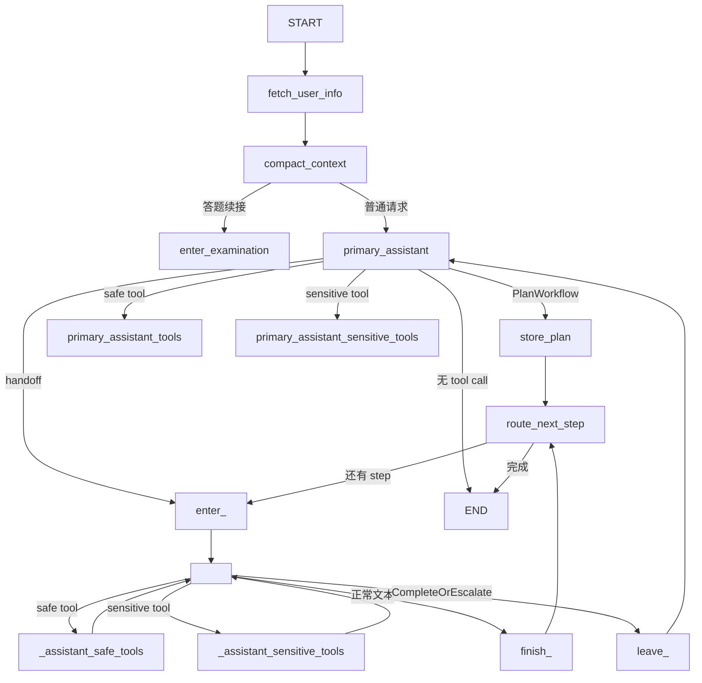

# 04 - LangGraph 图、节点和路由

本章把 compiled graph 展开成可追踪的节点和条件。读完后应能根据一条最后 AIMessage 和当前 state，手算出下一节点，并知道一个 Agent 正常结束、提前退出、工具失败和预算终止分别怎样收束。

## Graph 输入不是完整 `State`

Runtime 第一次调用 graph 时只提供：

```python
{
    "messages": [("user", user_input)],
    "user_id": tenant.user_id,
    "namespace": tenant.namespace,
}
```

其他字段来自已有 checkpoint 或后续节点 update。`State` 是 TypedDict，不代表每次输入必须包含全部键。

位置：[`core/state.py`](../../tech_doc_agent/app/core/state.py)。

## State 字段由谁写、谁读

| 字段 | 主要写入者 | 主要读取者 | 说明 |
|---|---|---|---|
| `messages` | Runtime input、assistant、tool/entry/exit/terminal node | 路由、prompt、SSE、history | 使用 LangGraph `add_messages` reducer |
| `user_id`, `namespace` | `fetch_user_info` | tools、session projection | checkpoint 内的 tenant 副本 |
| `user_info` | user-info node | primary prompt / scoped context | profile + memory 文本摘要 |
| `dialog_state` | entry/finish/leave/terminal | router、current agent | 栈 reducer；字符串 push，`pop` 弹栈 |
| `learning_target` | `store_plan` / user-info 保留 | prompts、retrieval context、learning write | 一轮稳定主题名 |
| `workflow_plan`, `plan_index` | `store_plan`、finish、failure/terminal | `route_next_step`、前端 stepper | plan_index 指向下一待执行步骤 |
| `parser_result` | `finish_parser` | relation/explanation/examination scope | markdown 解析后的 dict + raw fallback |
| `relation_result` | `finish_relation` | explanation/examination scope | 同上 |
| `examination_context` | `finish_examination` / user-info 清理 | examination continuation route/scope | 上一轮题目或评分上下文 |
| `reflection_*` | reflection/tool/assistant/entry/finish nodes | tool route、failure nodes | 一次请求内有限参数修复状态 |
| `budget_*` | request wrapper、budget tracker、terminal node | assistant/tool router、SSE/state | 累计账本 + 当前 delta + terminal reason |
| `context_metrics*` | context tracker | SSE/state/eval | prompt/checkpoint 大小及 LLM input usage |
| `provider_retry_usage*` | request wrapper、tool retry tracker | SSE/state/eval | embedding/web 等 transport operation |
| `conversation_summary` | context compactor | prompt builder、history projection | 对已闭合旧消息的确定性摘要 |

`*_delta` 是当前节点新变化，累计事实保存在无 `_delta` 的字段中。前端只展示累计值，不自己把 delta 相加。

## `GraphSpec` 把“有哪些东西”交给 builder

位置：[`graph/specs.py`](../../tech_doc_agent/app/graph/specs.py)。

`GraphSpec` 包含 primary、五个 subagent、user-info callable、execution policies 和四个 tracker/compactor。builder 不 import Agent registry 或 resources，它只消费 spec。

每个 `AgentSpec(key="parser", ...)` 自动派生节点名：

```text
entry_node          enter_parser
safe_tool_node      parser_assistant_safe_tools
sensitive_tool_node parser_assistant_sensitive_tools
leave_node          leave_parser
finish_node         finish_parser
```

这样五个 Agent 使用同一个注册模板，避免复制五套边/节点逻辑。角色差异由 tools、completion 和 scoped_messages 数据表达。

## 固定图拓扑

位置：[`graph/builder.py`](../../tech_doc_agent/app/graph/builder.py)。



所有 assistant/tool route 都还有预算终止分支；图中省略的 `budget_terminated -> END` 在任何执行阶段都可抢占正常路由。

## 请求起点的三层 wrapper

`fetch_user_info` 注册的 callable 实际是：

```text
provider_retry_usage_request_start_node(
  budgeted_request_start_node(
    context_metrics_request_start_node(
      user_info_node
    )
  )
)
```

调用由外到内进入，返回 update 时由内到外合并，所以一次 node update 同时包含 user_info、reflection reset、context reset、budget active、provider retry reset。SSE translator 可从同一个 update 产生多个指标事件。

`user_info_node` 还做一件容易忽略的事：若 state 有旧 `examination_context`，但最后一条 AI message 不是 examination，就将它清空，避免旧题目污染新任务。

## `compact_context` 后为什么可能绕过 primary

`route_after_user_info` 调 `should_route_to_examination(state)`。只要有非空 examination context，并且最新 user query 不是礼貌结束或明确的非考试请求，就直接进入 `enter_examination`。

这是一个确定性续答保护：用户提交答案时，避免 primary 自己评分或重新规划。关键词/规则集中在 `message_scope.py`，不是散落在 route 或 prompt 中。

## primary 路由优先级

`make_primary_router(sensitive_tool_names)` 返回闭包。它对最后一条 AIMessage 按顺序判断：

1. `budget_status == "terminating"` -> `budget_terminated`；
2. `tools_condition` 判断无 tool call -> `END`；
3. tool_calls 为空 -> `END`；
4. `reflection_status == "finalizing"` -> `primary_tool_failure`；
5. 只看第一个 tool call 的 name：
   - `PlanWorkflow` -> `store_plan`；
   - `To*Assistant` -> 对应 `enter_*`；
   - name 在 injected sensitive set -> sensitive node；
   - 其他 -> safe tool node。

模型绑定时设置 `parallel_tool_calls=False`，因此按第一个 tool call 路由是受模型配置支持的前提。若改成并行工具，当前路由无法把同一 AIMessage 同时分发到 safe 和 sensitive node，必须重设计并补测试。

## `store_plan` 的输入与输出

输入前提：最后一条 AIMessage 的第一个 tool call 是 `PlanWorkflow`，args 含 `steps` 和 `learning_target`。

输出 update：

```python
{
    "messages": [ToolMessage(tool_call_id=..., content="Workflow plan stored: ...")],
    "workflow_plan": args["steps"],
    "plan_index": 0,
    "parser_result": {},
    "relation_result": {},
    "learning_target": args["learning_target"],
    # reflection active reset
}
```

它会清掉上一轮 parser/relation result，防止新计划读取旧中间产物；不清 `examination_context`，后者由 user-info node 按对话情况处理。

随后 `route_next_step` 用 `workflow_plan[plan_index]` 查 `STEP_ENTRY_TARGETS`。index 越界或未知 step 都结束，不会猜一个近似节点。

## 子 Agent 的三种离开方式

`make_subagent_router(spec)`：

### 正常完成 -> `finish_<agent>`

最后 AIMessage 没有 tool call，`tools_condition == END`。finish node：

- `dialog_state="pop"`；
- `plan_index += 1`；
- 重置 active reflection；
- 按 completion policy 写结果。

completion policy：

| Agent | result key | 处理 |
|---|---|---|
| parser | `parser_result` | `parse_structured_result("parser", raw_text)` |
| relation | `relation_result` | `parse_structured_result("relation", raw_text)` |
| explanation | 无 | 最终 AIMessage 留在 messages |
| examination | `examination_context` | 保存原始文本 |
| summary | 无 | 最终 AIMessage 留在 messages |

finish 后直接 `route_next_step`，不回 primary。计划内步骤因此能自动串联。

### 主动退出 -> `leave_<agent>`

Agent 调 `CompleteOrEscalate`。leave node：

- 用同一 tool_call_id 写“控制权返回 primary”的 ToolMessage；
- pop dialog state；
- **清空整个 workflow_plan 和 plan_index**；
- 回到 primary 重新判断。

它不是“当前 step 完成并继续下一 step”。正常完成时绝不能为了交接而调用 `CompleteOrEscalate`，否则原计划会被取消。

### reflection 终止 -> leave/failure

subagent 在 `reflection_status=finalizing` 时再发 tool call，会被 router 送到 leave；leave node 为未执行的 tool calls 创建 `reflection_tool_chain_closed` error ToolMessage 并记录 terminal event。

primary 同情况进入 `primary_tool_failure`，产生面向用户的停止说明并 END。

## safe/sensitive tool node 的完整执行顺序

`_register_tool_node` 为两种节点都使用 `create_tool_node_with_fallback`，区别只在 compile 时 sensitive node 会成为 `interrupt_before`。

节点内部顺序：

```text
1. 取最后 AIMessage 的 pending tool calls
2. budget_tracker.block_tools_before_execution
3. evaluate_tool_policy（parser 总检索次数、连续相同调用）
4. ToolNode.invoke / ainvoke
5. 记录 tool_call.finished 或 error
6. budget_tracker.record_tools
7. apply_reflection_policy
8. provider_retry_tracker 归集 capture_retry_usage 中的 operation
```

ToolNode 原始异常由 fallback 调 `handle_tool_error`，变成一个或多个 error ToolMessage；每个 message 的 artifact 带结构化 `ApplicationError` payload，validation error 还可能带只含字段位置/类型的 repair context。

conditional edge 再调用 `route_after_tool_result`：

- budget terminating -> `budget_terminated`；
- reflection terminal -> Agent leave 或 primary failure；
- 其他 -> 回同一 assistant 继续读取工具结果。

## 工具策略不是 prompt 建议

[`graph/tool_policy.py`](../../tech_doc_agent/app/graph/tool_policy.py) 在真正执行前硬判断：

- parser 当前 step 中 `read_docs + web_search` 总次数超过 `PARSER_MAX_RETRIEVAL_CALLS`；
- 单一 tool name + 排序后 args 的连续相同调用次数超过 `MAX_IDENTICAL_TOOL_REPEATS`。

block 返回 synthetic error ToolMessage，目标工具根本不执行。之后仍进入 reflection policy；这些 policy error 通常不是 repairable validation error，因此要求 Agent 在无更多工具的情况下收束。

只改 prompt 中“最多 6 次”而不改 settings/tool policy，模型提示与硬限制会不一致。两处数值含义必须保持一致。

## Message scope 如何防止上下文串线

`assistant_node` 在调用 assistant 前执行：

```python
build_assistant_state(state, assistant.name, scoped_messages=...)
```

parser/relation/explanation/examination 的 scoped view 只有：

1. 一条系统构造的 HumanMessage，内含 current agent、最新 user query、learning target、plan/index、当前 handoff args、user_info 和允许的 structured result；
2. 当前 user turn 之后，**本 Agent 自己**发出的 AI tool call；
3. 与这些 call ID 对应的 ToolMessage。

依赖关系：

- relation 可见 parser_result；
- explanation/examination 可见 parser_result + relation_result；
- examination 在续答条件成立时可见 previous_examination_context。

若 structured result `parsed=True`，scope 会去掉 `raw_text` 以减少重复；解析失败时保留 raw_text 作为兜底。

summary 使用 full view；存在 conversation summary 时，summary message 加在近期原始消息前，并明确“新原始消息冲突时以新消息为准”。

## 预算终止怎样保持消息序列合法

budget 在 LLM/tool **之前**命中上限时，若最后 AIMessage 已发 tool call，`budget_closed_tool_messages` 为每个未执行 call 生成 error ToolMessage，避免 dangling tool call。随后 `budget_terminated` node：

- 记录 dimension/scope/observed/limit；
- 加一条人类可读 AIMessage；
- 清 plan/index；
- 写 `budget_status="terminated"`；
- 保留已累计 usage；
- 如在子 Agent 中则 pop dialog；
- END。

它承诺“完成当前原子步骤后停止”，所以 after-check 可能先记录本次调用，再终止后续步骤。

## 修改图时的常见坑

### 只加 `AgentSpec`，没加 route literal/map

还需同步 `WorkflowStep`、`STEP_ENTRY_TARGETS`、primary handoff command/router、SSE agent metadata、前端 `AgentKey`/颜色/视图和 topology tests。

### 把正常 finish 改成回 primary

会让每个 plan step 后都再次调用 primary，不仅变慢，还可能重新规划/重复 step。当前 plan 自动推进依赖 finish -> route_next_step。

### 在 state 中存不可序列化对象

Redis checkpoint、context size measure、session API 和 eval 都假设持久字段可稳定序列化。临时 tracker 对象应留在 composition/closure，不要写进 State。

### 直接执行 sensitive tool

是否暂停不是工具函数自己判断，而是该工具是否被放进角色 `sensitive_tools`，从而生成 sensitive node 并进入 `interrupt_before`。把写工具误放 safe tuple 会完全绕过 HITL。

### 修改节点名却只改 builder

SSE transition 解析、前端 Inspector、测试和可能的 eval 都依赖稳定 node name。节点名是内部但已被多处观测，不是随意重命名变量。

## 对应测试

- [`tests/test_graph_topology.py`](../../tests/test_graph_topology.py)：所有节点、边、conditional source、interrupt node；
- [`tests/test_graph_routes.py`](../../tests/test_graph_routes.py)：primary/subagent 每种 route；
- [`tests/test_graph_finish_nodes.py`](../../tests/test_graph_finish_nodes.py)：plan 推进和结果 key；
- [`tests/test_message_scope.py`](../../tests/test_message_scope.py)：Agent 可见消息隔离与 examination continuation；
- [`tests/test_graph_tool_policy.py`](../../tests/test_graph_tool_policy.py)：硬工具限制；
- [`tests/test_graph_tool_nodes.py`](../../tests/test_graph_tool_nodes.py)：执行、fallback、budget、retry 归集；
- [`tests/test_graph_reflection.py`](../../tests/test_graph_reflection.py)：repair/finalize/terminal 状态机；
- [`tests/test_graph_budgeting.py`](../../tests/test_graph_budgeting.py)：before/after budget 和合法收束。
