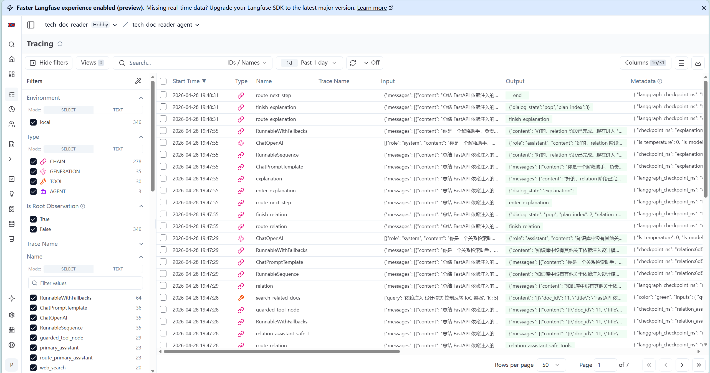

# Observability

项目的可观测性分成三层：SSE 事件流、结构化日志和可选 Langfuse tracing。

## Trace Context

每次 `/chat` 和 `/chat/approve` 都会生成或接收一个 `trace_id`。该 ID 会贯穿：

- SSE event payload
- 后端结构化日志
- LangGraph config metadata
- Langfuse trace metadata

同时会带上：

- `session_id`
- `user_id`
- `namespace`
- 当前 agent / tool / node 信息

## SSE Events

前端 Inspector 直接消费后端 SSE 事件。常见事件包括：

- `session_snapshot`
- `agent_transition`
- `plan_update`
- `token`
- `agent_message`
- `structured_result`
- `tool_call`
- `tool_result`
- `interrupt_required`
- `no_pending_interrupt`
- `done`
- `error`

SSE 事件既用于 UI 展示，也用于 eval runner 和 concurrency benchmark。

## Langfuse

启用 Langfuse tracing：

```bash
LANGFUSE_ENABLED=true
LANGFUSE_PUBLIC_KEY=your_public_key
LANGFUSE_SECRET_KEY=your_secret_key
LANGFUSE_BASE_URL=https://cloud.langfuse.com
```

启用后，`ChatRuntime` 会把 Langfuse `CallbackHandler` 注入 LangGraph/LangChain config，并在日志中输出对应的 `langfuse_trace_url`。

本地如果需要请求结束后立即刷新 trace，可设置：

```bash
LANGFUSE_FLUSH_ON_REQUEST=true
```



## Health Checks

- `GET /health`：进程存活探针。
- `GET /ready`：运行依赖就绪探针。

`/ready` 会检查 runtime、graph、checkpointer、resource container、document store、hybrid retriever、learning store、memory store、web search backend 和 Redis。
