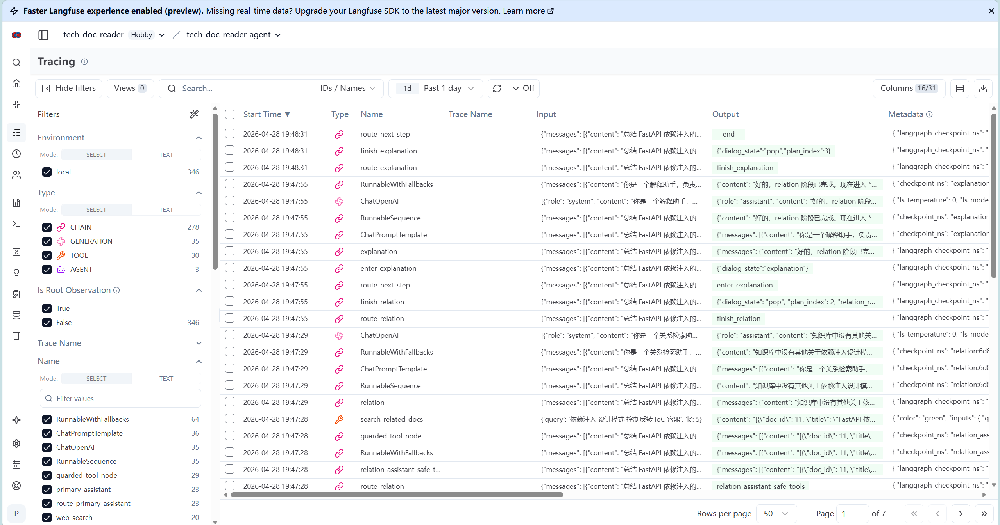

# Observability

项目的可观测性分成三层：SSE 事件流、结构化日志和可选 Langfuse tracing。

## Trace Context

每次 `/chat` 和 `/chat/approve` 都会生成或接收一个 `trace_id`。该 ID 会贯穿：

- SSE event payload
- 后端结构化日志
- LangGraph config metadata
- Langfuse trace metadata

同时会带上：

- `session_id`
- `user_id`
- `namespace`
- 当前 agent / tool / node 信息

## Redaction

结构化日志和 Langfuse export 共用 `core/redaction.py`：在离开进程前递归处理 Authorization/cookie、API key、password/secret/token、JWT、带密码 URL、常见邮箱和手机号。UUID 不默认视为 PII，以保留 trace/session correlation。

若需要跨事件关联 user_id，可配置至少 16 字节的随机 HMAC key：

```bash
TELEMETRY_PSEUDONYM_KEY=replace_with_a_random_secret_of_at_least_16_bytes
```

配置后 `user_id` 输出为稳定 `pseudonym:<digest>`。这是 keyed pseudonymization，不是匿名化；key 应通过部署 secret manager 注入，不提交到仓库。留空时只做字段/文本模式脱敏，不对普通 opaque user id 做无密钥 hash。

## SSE Events

前端 Inspector 直接消费后端 SSE 事件。常见事件包括：

- `session_snapshot`
- `agent_transition`
- `plan_update`
- `token`
- `agent_message`
- `structured_result`
- `usage_update`
- `budget_started`
- `budget_terminated`
- `context_metrics_update`
- `provider_retry_update`
- `tool_call`
- `tool_result`
- `guardrail_blocked`
- `interrupt_required`
- `no_pending_interrupt`
- `done`
- `error`

SSE 事件既用于 UI 展示，也用于 eval runner 和 concurrency benchmark。

`usage_update` 与 `budget_started` / `budget_terminated` 分别记录 LLM/tool 累计用量和硬预算生命周期。`context_metrics_update` 记录 checkpoint、受控 prompt 和 provider input-token 等上下文测量。三类事件都同时携带当前节点 delta 和/或累计版本化对象；`session_snapshot` 与 session state API 提供最近一次持久化累计值，消费者不应靠重放全部历史事件重建事实。

`provider_retry_update` 把 embedding/web transport retry 从瞬时 `retry.final` 日志提升为 checkpoint、REST、SSE 和 online eval 共用的版本化事实。一次逻辑 operation 与真实 provider attempts 分开统计；成功但经过 retry 的 operation 计入 `recovered_operations`，重试耗尽计入 `exhausted_operations`。该账本不保存原始异常文本，也不与 LLM/tool 执行预算混算。

`tool_result` 和 terminal `error` 使用显式 `status`、稳定 `code`、`retryable`、`dependency`、`cause_type` 与 `safe_message`。原始异常文本不会进入 SSE payload；前端也不再根据工具自然语言内容猜测成功或失败。

## Local Trace Files

后端可以独立于外部观测服务，将一次 `/chat` 或 `/chat/approve` 请求的诊断链路写入本地 JSONL：

```bash
LOCAL_TRACE_ENABLED=true
LOCAL_TRACE_RETENTION_COUNT=100
LOCAL_TRACE_MAX_PAYLOAD_BYTES=20971520
LOCAL_TRACE_CAPTURE_CONTENT=true
```

文件位于 `${DATA_PATH}/traces/`，文件名包含前端 SSE payload 中的 `trace_id`。每行记录一个请求、业务事件或 LangChain chain/LLM/tool/retriever span 状态，并通过 `run_id` / `parent_run_id` 保留父子关系；流式 token 不单独写盘。

执行中的文件以 `.active.jsonl` 结尾，结束后原子转换为 `.jsonl`。后端只保留最近 `LOCAL_TRACE_RETENTION_COUNT` 个完成文件；进程重启时会把遗留 active 文件标记为 `abandoned`。达到单 Trace 内容预算后，大型输入输出会标为 omitted，但步骤状态和终态仍继续记录。

开启 `LOCAL_TRACE_CAPTURE_CONTENT` 会保存完整用户输入、提示词、模型输出、工具参数/结果和原始异常堆栈。该目录已经被 Git 忽略，但仍应视为敏感本地数据：不要提交、公开提供下载或直接分享文件。

当前文件 writer 面向项目现有的单 Uvicorn worker 部署；如果未来启用多 worker 并共享同一目录，需要先补充跨进程文件锁或改为每 worker 独立目录。

## Langfuse

启用 Langfuse tracing：

```bash
LANGFUSE_ENABLED=true
LANGFUSE_PUBLIC_KEY=your_public_key
LANGFUSE_SECRET_KEY=your_secret_key
LANGFUSE_BASE_URL=https://cloud.langfuse.com
```

启用后，`ChatRuntime` 会把 Langfuse `CallbackHandler` 注入 LangGraph/LangChain config，并在日志中输出对应的 `langfuse_trace_url`。

Langfuse client 使用与结构化日志相同的 mask callback，因此 callback 自动捕获的 prompt、tool input 和 model output 也经过同一 policy，而不只是 metadata。

本地如果需要请求结束后立即刷新 trace，可设置：

```bash
LANGFUSE_FLUSH_ON_REQUEST=true
```



## Health Checks

- `GET /health`：进程存活探针。
- `GET /ready`：运行依赖就绪探针。

`/ready` 会检查 runtime、graph、checkpointer、resource container、document store、hybrid retriever、learning store、memory store、web search backend 和 Redis。
