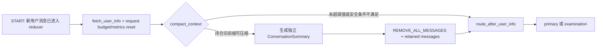

# 2026-07-12：安全上下文压缩、版本化摘要与历史投影

## 本批结论

本批在上一阶段 `ContextMetrics` 的观测基础上完成了可执行的上下文压缩边界，但没有默认开启压缩。

最终落地的是：

- 仅在一个新请求进入 graph 的 `START` 路径时评估压缩，不在 tool execution、敏感审批 interrupt 或 resume 中途改写消息；
- 只压缩超过阈值且已经闭合的旧消息前缀，最近若干用户轮次继续保留为原始消息；
- 使用 LangGraph 支持的 `RemoveMessage(id=REMOVE_ALL_MESSAGES)` 加 retained messages 原子替换，不直接覆盖某个消息下标；
- 将 `ConversationSummary` 放入独立 checkpoint state，不把摘要伪造成 ToolMessage，也不把旧 tool payload 混入摘要；
- primary 与产品 `summary` Agent 在 prompt 构造阶段读取摘要，四个 scoped Agent 默认看不到这份跨轮摘要；
- 会话历史 API 把独立摘要投影为一个 `conversation_summary` system item，避免压缩后旧历史在 UI 中无提示地消失；
- 默认阈值为 0，即机制存在但不自动压缩。只有显式配置阈值并接受摘要式历史保留后才启用。

这批解决的是“如何安全压缩、如何审计、如何回滚”的结构问题；是否默认启用仍需长会话回答一致性、token、checkpoint 大小和延迟评估提供证据。

## 为什么不能直接删旧 messages

代码审计发现 `State.messages` 同时承担三种职责：

1. primary/summary 的模型上下文；
2. LangGraph checkpoint 中的工作流消息日志；
3. `/history` 与 `/history/view` 的会话恢复数据源。

因此，直接删除旧 messages 虽然能降低模型输入和 checkpoint 大小，却会改变刷新页面后的历史恢复行为。这不是单纯的内部性能优化，而是用户可见的数据保留语义变化。

本批采用两个约束降低风险：

- 默认关闭，避免升级后静默改变已有会话；
- 启用后由 history query 层把 `ConversationSummary` 显式投影为历史占位，而不是假装旧原文仍然存在。

若产品未来要求“模型上下文压缩，但用户仍可查看全部逐字历史”，下一步应增加独立 durable transcript repository；不能再把完整 transcript 塞回同一个 graph checkpoint，否则会抵消 checkpoint 压缩收益。

## 新的请求路径



审批 resume 不经过 `START`，所以不会进入 `compact_context`。这一点使待执行的敏感 tool call 不会在 approve 前后被拆开。

## 不可丢信息与执行条件

`plan_context_compaction()` 是不依赖 graph builder 的纯策略。只有所有条件都满足才产生 `ContextCompactionPlan`：

| 信息/状态 | 保护方式 |
|---|---|
| 当前用户消息 | 要求 checkpoint 最后一条消息为 human，并始终位于 retained 区间 |
| 最近原始对话 | 按 `CONTEXT_COMPACTION_KEEP_RECENT_TURNS` 保留最近 N 个 human turn 及其后消息 |
| 未完成 workflow plan | `workflow_plan` 非空时只有 `plan_index == len(workflow_plan)` 才可压缩 |
| 活跃 sub-agent | `dialog_state` 非空时拒绝压缩 |
| reflection/finalization | `repairing/finalizing/terminal` 状态拒绝压缩 |
| tool call/result 配对 | 被移除前缀中的 tool call ID 与 ToolMessage ID 必须一一相等，重复、缺 ID、跨边界都拒绝 |
| parser/relation 结构化结果 | 位于独立 state 字段，不被 message reducer 修改 |
| examination context | 位于独立 state 字段，继续由原 user-info policy 决定是否清理 |
| budget/context metrics | 位于独立 state 字段；压缩节点只更新 messages 与 conversation_summary |
| 敏感审批 | interrupt/resume 不经过压缩节点；待审批 tool call 保持原样 |

如果策略无法证明旧前缀闭合，就返回明确 skip reason，并记录不含消息内容的 `context.compaction.skipped` telemetry。

## 版本化摘要模型

`core/conversation_summary.py` 定义 schema version 1：

| 字段 | 含义 |
|---|---|
| `summary_id` | 对 schema、generator、predecessor、content 和 source ranges 的稳定 SHA-256 |
| `predecessor_summary_id` | 上一版摘要 ID；配合 checkpoint history 审计增量生成链 |
| `generator_id` | 当前摘要生成策略版本，例如 `extractive-closed-turns-v1` |
| `content` | 有长度上限的闭合历史摘要 |
| `source_ranges` | 每批源消息的首尾 ID、消息数与规范化内容 SHA-256 |
| `covered_message_count` | 所有 source range 消息数之和，反序列化时重新校验 |

反序列化会验证：

- schema 版本；
- ID、计数和 SHA-256 格式；
- `covered_message_count` 是否与 source ranges 一致；
- 根据持久化内容重算的 `summary_id` 是否一致。

损坏的摘要不会被静默注入 prompt，而是转换为受控 `conversation_summary_invalid` checkpoint validation error。

## 为什么先用确定性 extractive summarizer

没有把现有产品 `summary` Agent 复用成 context compactor，原因有三点：

1. 产品 Agent 会读取学习历史、更新学习状态，并可能进入敏感审批；它的职责不是 checkpoint 维护。
2. 在请求开始时额外调用 LLM 会新增预算、retry、定价、失败恢复和 latency 语义。
3. 在长会话 eval 尚未完成前，直接引入生成式摘要会让回答差异难以归因。

当前 `ExtractiveConversationSummarizer` 采用确定性、可离线测试的策略：

- 保留 human 与非空 assistant 文本；
- 对 tool call 只记录 tool 名，不复制 args；
- 对 ToolMessage 只记录 tool 名与 success/error 状态，不复制 content/artifact；
- 单条摘要和总摘要都有字符上限；
- 超长增量摘要同时保留旧摘要开头、新批次开头和新批次尾部。

这不是在宣称 extractive 摘要质量优于模型摘要，而是先建立安全、可审计、无额外 provider 调用的基线。后续可通过 `ConversationSummarizer` port 注入 provider-backed 实现，并用同一长会话集比较。

## Prompt 与 scoped Agent 边界

摘要只在模型调用前构造临时 `SystemMessage(name="conversation_summary")`：

- 不写回 `State.messages`；
- primary 和产品 summary Agent 可读取；
- parser/relation/explanation/examination 继续走原 `build_scoped_state`，不会得到摘要或其他 Agent 的原始 tool result；
- prompt 中明确声明“更新的原始消息优先于摘要”，避免旧摘要覆盖当前用户意图。

这也使 `ContextMetrics` 能观察压缩后的 checkpoint 消息数，以及 full Agent prompt 多出的单条摘要消息。

## 配置与启用策略

新增配置：

```text
CONTEXT_COMPACTION_MAX_MESSAGES=0
CONTEXT_COMPACTION_MAX_SERIALIZED_BYTES=0
CONTEXT_COMPACTION_KEEP_RECENT_TURNS=4
CONTEXT_SUMMARY_MAX_CHARS=12000
```

- 两个 threshold 任一为正即可启用；两者都为 0 时关闭；
- message threshold 和 serialized-byte threshold 使用 OR 语义；
- byte threshold 测量可被压缩的 message envelope，而不是把不可压缩的任意 state 字段误算成触发源；
- keep recent turns 至少为 1；summary max chars 至少为 256。

`.env.example` 与 Docker Compose 使用相同默认值。当前不会修改用户本地 `.env`。

## 实施中实际遇到的问题

### 1. messages 也是历史 API

原 TODO 只强调 primary/summary/checkpoint 增长，没有明确记录历史 API 直接读取同一个 state 字段。若默认开启，旧对话会在页面刷新后消失。

解决：默认关闭；启用后 query 层投影摘要占位；完整逐字 transcript 的长期方案单独进入 repository 设计。

### 2. 单条 RemoveMessage 依赖每条消息 ID

LangGraph reducer 会为缺 ID 的消息分配 ID，但逐条构造 `RemoveMessage(id=...)` 容易在旧 checkpoint、测试 fixture 或异常消息上形成部分删除。

解决：使用官方支持的 `REMOVE_ALL_MESSAGES` sentinel，再在同一次 reducer update 中重加 retained messages，实现全量替换的原子语义；source range 仍要求真实消息 ID 以支持审计。若旧 fixture/checkpoint 的源消息没有 ID，压缩会记录 `source_metadata_unavailable` 并 fail-open 返回空 update，不阻断用户请求。

### 3. tool call 与结果可能跨压缩边界

按固定消息数切片会把 AI tool call 与 ToolMessage 拆开，导致 provider 请求格式错误，甚至在审批后丢失待执行动作。

解决：按 human turn 选择前缀，并对前缀 tool call/result ID 做集合与重复检查；任何缺失、重复或跨边界都 skip。

### 4. 摘要截断会丢掉最新段落主题

初版总长度限制只保留整个字符串的头和尾。测试证明：若最新消息很长，尾部能保留正文，却可能把位于新段开头的主题标签截掉。

解决：增量压缩改为三段预算——旧摘要头、新批次头、新批次尾；回归测试锁定 oldest/newest marker 都存在。

### 5. summary 名称存在职责歧义

仓库已有 `summary` Agent。若新增代码也笼统命名为 summary service，后续容易误把学习总结与上下文维护混在一起。

解决：领域模型使用 `ConversationSummary`，执行 port 使用 `ConversationSummarizer`，产品 Agent 名称保持不变；composition root 显式注入两者。

## 测试覆盖

新增测试覆盖：

- versioned summary round-trip、篡改检测、predecessor lineage；
- tool args、ToolMessage raw payload 不进入摘要；
- 字符上限与三段保留策略；
- closed-prefix 选择及最近 turn 保留；
- active dialog/workflow/reflection 拒绝压缩；
- 未配对 tool call 拒绝跨边界压缩；
- `REMOVE_ALL_MESSAGES` reducer 后只留下 retained messages；
- primary/summary prompt 注入，scoped Agent 不泄露摘要或 foreign tool result；
- compiled graph 连续请求只在下一次 START 压缩；
- history/history-view/session-state 对摘要的投影与计数；
- Graph topology、settings、composition 与 settings-free graph architecture gate。

## 验证状态

| 验证 | 结果 |
|---|---|
| 本批 targeted Python pytest | 83 passed；3 个既有第三方/pytest cache warning |
| 全量后端 pytest | 577 passed；3 个既有 deprecation warning 与 1 个本机 pytest cache 权限 warning |
| CI mypy core/schema | 21 source files，passed |
| 本批 direct mypy | 8 source files，passed |
| 全仓 Ruff | passed |
| 前端 targeted/full test | 2 files / 9 tests；19 files / 74 tests，passed |
| 前端 typecheck/build/audit | build 2041 modules；0 vulnerabilities |
| Docker Compose config | passed |
| `git diff --check` | passed |
| `docs/todo` 隔离 | passed，任务单未进入 HEAD、origin/main 差异或待提交集合 |

## 回滚点

运行时可立即把两个 threshold 都设为 0，graph 仍保留节点但返回空 update，不会删除消息或生成摘要。

若需要代码级回滚，删除 `compact_context` 节点并恢复 `fetch_user_info` 的条件路由即可；独立 `conversation_summary` state 对旧代码是可忽略附加字段，不影响现有 checkpoint 反序列化。

## 下一步

1. 构建固定长会话 corpus，同时运行 compaction off/on，比较最终回答或 tool plan 一致性。
2. 从 `ContextMetrics` 与 budget usage 记录 checkpoint bytes、primary/summary input tokens 和 latency before/after。
3. 明确历史产品要求：摘要式历史是否可接受；若不可接受，先引入独立 durable transcript repository。
4. 只有评估通过并确认数据保留语义后，才讨论非零默认阈值或 provider-backed summarizer。
